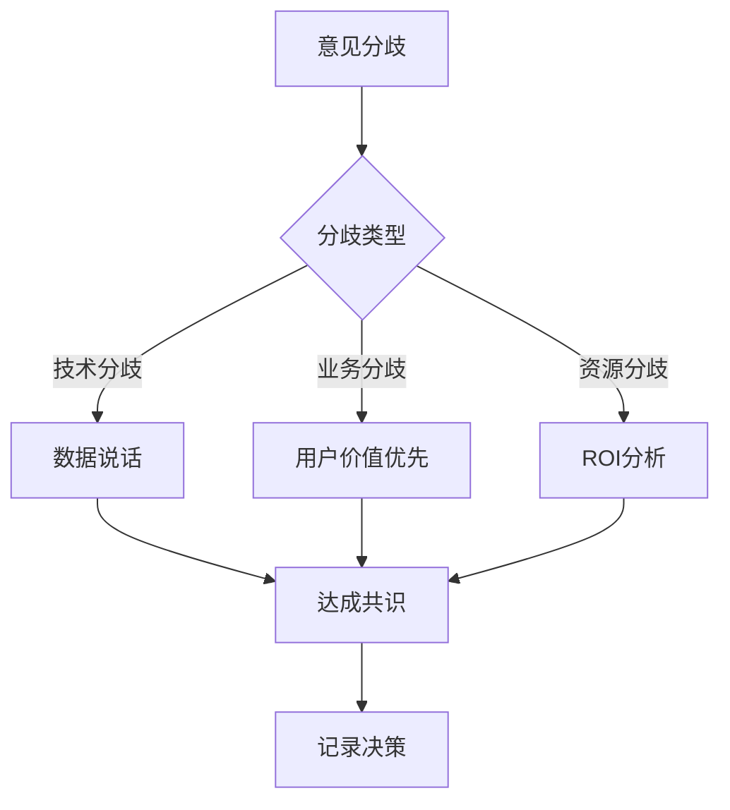

# 需求讨论SOP

## 目的
建立高效的需求讨论机制，确保各方对需求理解一致，减少后期返工。

## 讨论流程

### 1. 讨论准备

#### 1.1 会前准备（发起人）
- **提前2天发送材料**: 需求文档、原型图、数据支撑
- **明确讨论目标**: 需要决策的问题清单
- **邀请相关人员**: 只邀请必要的决策者和执行者
- **预定会议资源**: 会议室、投影设备、白板

#### 1.2 参会准备（参与者）
- **阅读材料**: 提前了解需求背景
- **准备问题**: 记录疑问和建议
- **评估影响**: 从自己职能角度评估
- **带上数据**: 相关的数据和案例

### 2. 讨论议程

#### 2.1 标准议程（60分钟）
```markdown
1. 开场介绍 (5分钟)
   - 会议目标
   - 议程说明
   - 时间安排

2. 需求背景 (10分钟)
   - 用户痛点
   - 业务目标
   - 数据支撑

3. 方案介绍 (15分钟)
   - 功能演示
   - 流程说明
   - 技术方案

4. 问题讨论 (20分钟)
   - 可行性讨论
   - 风险评估
   - 资源评估

5. 决策确认 (5分钟)
   - 达成共识
   - 行动计划
   - 责任分工

6. 总结收尾 (5分钟)
   - 会议纪要
   - 后续安排
   - 问题跟进
```

### 3. 讨论技巧

#### 3.1 有效沟通
- **STAR原则**
  - **S**ituation: 描述背景情况
  - **T**ask: 说明要解决的问题
  - **A**ction: 提出的解决方案
  - **R**esult: 预期的结果

#### 3.2 冲突解决


#### 3.3 决策方法
- **DACI模型**
  - **D**river: 推动者（产品经理）
  - **A**pprover: 审批者（产品总监）
  - **C**ontributor: 贡献者（开发、设计）
  - **I**nformed: 知情者（运营、客服）

### 4. 会议产出

#### 4.1 会议纪要模板
```markdown
# [需求名称]讨论会议纪要

**日期**: 2024-12-30
**参会人**: 张三(产品)、李四(开发)、王五(设计)
**记录人**: 赵六

## 讨论内容
1. [讨论点1]
   - 问题：xxx
   - 结论：xxx
   - 负责人：xxx

2. [讨论点2]
   - 问题：xxx
   - 结论：xxx
   - 负责人：xxx

## 决策事项
- [ ] 决策1：具体内容（负责人，截止日期）
- [ ] 决策2：具体内容（负责人，截止日期）

## 待办事项
- [ ] 行动1：具体内容（负责人，截止日期）
- [ ] 行动2：具体内容（负责人，截止日期）

## 风险提示
- 风险1：描述及应对措施
- 风险2：描述及应对措施

## 下次会议
- 时间：xxxx
- 议题：xxxx
```

### 5. 线上讨论

#### 5.1 异步讨论（推荐）
- **工具选择**: Slack、飞书、企业微信
- **讨论规范**:
  ```markdown
  【需求讨论】功能名称
  
  背景：简要说明
  方案：链接到文档
  问题：
  1. @技术 - 技术可行性如何？
  2. @设计 - UI复杂度评估？
  3. @测试 - 测试重点在哪？
  
  截止时间：明天下午3点前回复
  ```

#### 5.2 视频会议
- **适用场景**: 复杂需求、紧急决策
- **注意事项**:
  - 提前测试设备
  - 共享屏幕权限
  - 录制会议（如需要）
  - 会后及时同步

### 6. 常见问题处理

#### 6.1 讨论低效
**问题表现**:
- 讨论偏离主题
- 无法达成共识
- 会议时间过长

**解决方案**:
- 设定计时器，控制每个环节时间
- 指定主持人，及时拉回主题
- 复杂问题线下先沟通

#### 6.2 理解偏差
**问题表现**:
- 各方理解不一致
- 会后执行偏差
- 频繁返工

**解决方案**:
- 使用可视化工具（原型、流程图）
- 现场确认理解（复述一遍）
- 会议纪要及时确认

#### 6.3 决策困难
**问题表现**:
- 各执己见
- 决策反复
- 责任不清

**解决方案**:
- 明确决策机制（谁有最终决定权）
- 设定决策标准（用户价值、ROI）
- 限时决策（避免无限讨论）

## 最佳实践案例

### 案例：AI启蒙时光的拍照识别功能

**背景**: 需要讨论拍照识别功能的实现方案

**准备**:
1. 竞品分析报告（3个竞品的实现方式）
2. 技术预研结果（3种技术方案对比）
3. 用户调研数据（100份问卷结果）

**讨论过程**:
1. 产品介绍用户需求和业务价值（10分钟）
2. 技术介绍三种方案的优劣（15分钟）
3. 设计展示交互原型（10分钟）
4. 各方提问和讨论（20分钟）
5. 投票选择方案2（5分钟）

**产出**:
- 确定使用云端AI识别方案
- 明确2周完成MVP版本
- 分工：技术负责API对接，设计完善交互，产品准备测试用例

**效果**:
- 一次会议确定方案，避免反复
- 各方充分参与，理解一致
- 明确分工，推进顺利

## 度量指标

- **会议效率**: 平均会议时长
- **决策质量**: 决策变更率
- **执行偏差**: 实际交付vs会议决策
- **满意度**: 参会人员反馈

## 工具推荐

### 协作工具
- **Figma**: 实时设计协作
- **Miro**: 在线白板头脑风暴
- **腾讯文档**: 实时文档协作

### 会议工具
- **腾讯会议**: 视频会议
- **飞书妙记**: 会议记录
- **Calendly**: 会议安排

---

*基于AI启蒙时光项目实践总结*  
*强调高效沟通和快速决策*