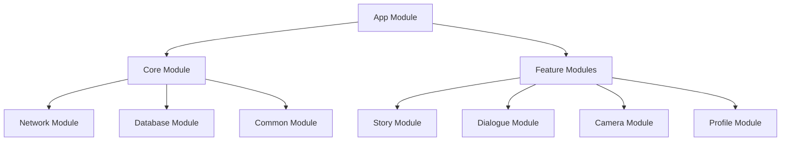
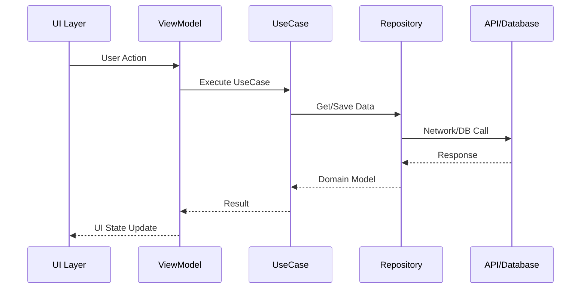

# 架构设计SOP

## 目的
建立标准化的架构设计流程，确保系统架构清晰、可扩展、易维护。

## 架构设计原则

### 1. 核心原则
- **SOLID原则**: 单一职责、开闭原则、里氏替换、接口隔离、依赖倒置
- **KISS原则**: Keep It Simple, Stupid - 保持简单
- **DRY原则**: Don't Repeat Yourself - 避免重复
- **YAGNI原则**: You Aren't Gonna Need It - 不要过度设计

### 2. Android特定原则
- **关注点分离**: UI逻辑、业务逻辑、数据逻辑分离
- **数据驱动UI**: UI是数据的展现，数据变化驱动UI更新
- **生命周期感知**: 正确处理Activity/Fragment生命周期
- **依赖注入**: 降低耦合，提高可测试性

## 架构设计流程

### 1. 需求分析

#### 1.1 功能需求分析
```markdown
# 功能需求清单
- [ ] 核心功能模块划分
- [ ] 功能依赖关系梳理
- [ ] 数据流向分析
- [ ] 第三方服务集成需求
```

#### 1.2 非功能需求分析
```markdown
# 非功能需求评估表
| 需求类型 | 具体要求 | 架构影响 |
|---------|---------|---------|
| 性能 | 启动时间<3秒 | 懒加载、模块化 |
| 可扩展性 | 支持功能插件化 | 组件化架构 |
| 安全性 | 数据加密存储 | 安全层设计 |
| 可维护性 | 模块独立更新 | 模块解耦 |
```

### 2. 架构选型

#### 2.1 常见架构模式对比
| 架构模式 | 优点 | 缺点 | 适用场景 |
|---------|------|------|---------|
| MVC | 简单直观 | 耦合度高 | 小型应用 |
| MVP | 可测试性好 | 接口过多 | 中型应用 |
| MVVM | 数据绑定，解耦 | 学习曲线 | 推荐使用 |
| MVI | 单向数据流 | 复杂度高 | 大型应用 |

#### 2.2 AI启蒙时光架构选择
```kotlin
// Clean Architecture + MVVM
├── Presentation Layer (MVVM)
│   ├── View (Compose UI)
│   ├── ViewModel (状态管理)
│   └── UI Model (UI状态)
├── Domain Layer (业务逻辑)
│   ├── UseCase (用例)
│   ├── Repository Interface
│   └── Domain Model
└── Data Layer (数据处理)
    ├── Repository Implementation
    ├── Local Data Source (Room)
    └── Remote Data Source (Retrofit)
```

### 3. 详细设计

#### 3.1 模块划分


#### 3.2 数据流设计


#### 3.3 技术栈选择
```yaml
# 技术栈配置
Language: Kotlin
MinSDK: 24
TargetSDK: 34

UI:
  - Jetpack Compose
  - Material3
  - Accompanist

Architecture:
  - ViewModel
  - LiveData/StateFlow
  - Hilt (DI)
  - Navigation Component

Network:
  - Retrofit2
  - OkHttp3
  - Gson/Moshi

Database:
  - Room
  - DataStore

Async:
  - Coroutines
  - Flow

Testing:
  - JUnit
  - Mockk
  - Espresso
```

### 4. 架构文档

#### 4.1 架构决策记录（ADR）
```markdown
# ADR-001: 使用Clean Architecture

## 状态
已采纳

## 背景
需要一个可维护、可测试、可扩展的架构

## 决策
采用Clean Architecture + MVVM模式

## 理由
1. 清晰的分层，职责明确
2. 高可测试性
3. 独立于框架
4. 独立于UI
5. 独立于数据库

## 后果
- 正面：代码结构清晰，易于维护
- 负面：初期开发成本较高，有学习曲线
```

#### 4.2 架构图
```
┌─────────────────────────────────────────────┐
│                Presentation                  │
│  ┌─────────┐  ┌──────────┐  ┌──────────┐  │
│  │Compose UI│  │ViewModel│  │Navigator │  │
│  └─────────┘  └──────────┘  └──────────┘  │
└─────────────────────────────────────────────┘
                      │
┌─────────────────────────────────────────────┐
│                  Domain                      │
│  ┌─────────┐  ┌──────────┐  ┌──────────┐  │
│  │ UseCase │  │  Model   │  │Repository│  │
│  └─────────┘  └──────────┘  │Interface │  │
└─────────────────────────────────────────────┘
                      │
┌─────────────────────────────────────────────┐
│                   Data                       │
│  ┌─────────┐  ┌──────────┐  ┌──────────┐  │
│  │  API    │  │   DAO    │  │Repository│  │
│  │ Service │  │  (Room)  │  │   Impl   │  │
│  └─────────┘  └──────────┘  └──────────┘  │
└─────────────────────────────────────────────┘
```

### 5. 代码规范

#### 5.1 包结构
```
com.company.app/
├── data/
│   ├── local/
│   │   ├── dao/
│   │   ├── database/
│   │   └── entity/
│   ├── remote/
│   │   ├── api/
│   │   ├── dto/
│   │   └── interceptor/
│   └── repository/
├── domain/
│   ├── model/
│   ├── repository/
│   └── usecase/
├── presentation/
│   ├── ui/
│   │   ├── screen/
│   │   ├── component/
│   │   └── theme/
│   ├── viewmodel/
│   └── navigation/
└── di/
    └── module/
```

#### 5.2 命名规范
```kotlin
// 类命名
class StoryViewModel : ViewModel()          // ViewModel
class GenerateStoryUseCase                  // UseCase
interface StoryRepository                   // Repository接口
class StoryRepositoryImpl : StoryRepository // Repository实现

// 函数命名
fun generateStory(): Flow<Story>            // 动词开头
suspend fun saveStory(story: Story)         // 明确意图

// 变量命名
private val _uiState = MutableStateFlow()   // 私有状态
val uiState: StateFlow = _uiState           // 公开状态
```

### 6. 性能考虑

#### 6.1 启动优化
```kotlin
// 延迟初始化
class MyApp : Application() {
    val analyticsManager by lazy { AnalyticsManager() }
}

// 按需加载模块
@Module
@InstallIn(SingletonComponent::class)
object AppModule {
    @Provides
    fun provideHeavyService(): HeavyService {
        return HeavyService() // 只在注入时创建
    }
}
```

#### 6.2 内存优化
```kotlin
// 使用弱引用避免内存泄漏
class MyViewModel : ViewModel() {
    private var callback: WeakReference<Callback>? = null
    
    override fun onCleared() {
        super.onCleared()
        callback?.clear()
    }
}
```

### 7. 安全设计

#### 7.1 数据安全
```kotlin
// 加密存储敏感数据
@Module
object SecurityModule {
    @Provides
    fun provideEncryptedPrefs(
        @ApplicationContext context: Context
    ): SharedPreferences {
        return EncryptedSharedPreferences.create(
            context,
            "secure_prefs",
            MasterKey.Builder(context)
                .setKeyScheme(MasterKey.KeyScheme.AES256_GCM)
                .build(),
            EncryptedSharedPreferences.PrefKeyEncryptionScheme.AES256_SIV,
            EncryptedSharedPreferences.PrefValueEncryptionScheme.AES256_GCM
        )
    }
}
```

## 架构评审

### 评审清单
- [ ] 是否满足所有功能需求？
- [ ] 是否考虑了扩展性？
- [ ] 模块间依赖是否合理？
- [ ] 是否有循环依赖？
- [ ] 性能瓶颈是否识别？
- [ ] 安全风险是否评估？
- [ ] 技术债务是否可控？

### 评审参与者
- 技术架构师（主导）
- 高级开发工程师
- 产品经理
- QA负责人

## 最佳实践

### DO ✅
1. **保持简单**: 先实现MVP，逐步演进
2. **模块化设计**: 高内聚低耦合
3. **依赖抽象**: 依赖接口而非实现
4. **统一规范**: 代码风格一致
5. **文档同步**: 架构变更及时更新文档

### DON'T ❌
1. **过度设计**: 不要为未来10年设计
2. **技术炫技**: 选择团队能驾驭的技术
3. **忽视债务**: 定期重构和优化
4. **固步自封**: 持续学习新技术
5. **独断专行**: 架构决策要团队共识

## 架构演进

### 演进策略
1. **渐进式重构**: 不要推倒重来
2. **A/B测试**: 新架构先小范围试点
3. **度量驱动**: 用数据验证架构改进
4. **向下兼容**: 保证平滑过渡

### 技术债务管理
```markdown
# 技术债务记录
| 债务描述 | 产生原因 | 影响范围 | 优先级 | 解决方案 |
|---------|---------|---------|--------|---------|
| 网络层未统一错误处理 | 快速开发 | 所有API调用 | 高 | 统一拦截器 |
| 部分模块耦合度高 | 需求变更 | 故事模块 | 中 | 重构解耦 |
```

---

*基于AI启蒙时光Clean Architecture实践*  
*适用于中大型Android项目*