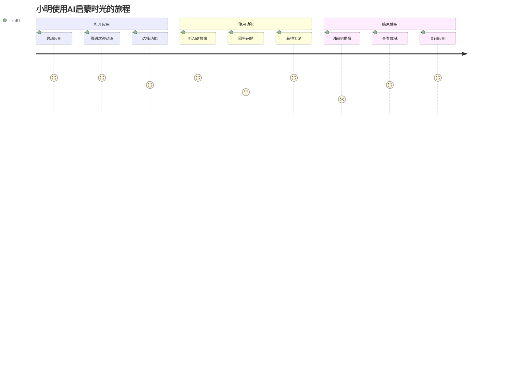

# UX/UI设计SOP

## 目的
建立标准化的UX/UI设计流程，确保产品界面美观、交互流畅、用户体验优秀。

## 设计流程

### 1. 用户研究

#### 1.1 用户画像
```markdown
# AI启蒙时光用户画像示例

## 主要用户：小明（4岁）
- **年龄**: 4岁
- **性别**: 男
- **特征**: 
  - 好奇心强，喜欢探索
  - 注意力持续时间短（5-10分钟）
  - 喜欢鲜艳的颜色和可爱的形象
  - 手指控制能力有限
- **使用场景**:
  - 早上起床后（7:00-8:00）
  - 晚饭后睡前（19:00-20:00）
  - 每次15-20分钟

## 决策用户：王妈妈（32岁）
- **年龄**: 32岁
- **职业**: 白领
- **关注点**:
  - 教育价值
  - 内容安全
  - 使用时长控制
  - 孩子的学习进展
```

#### 1.2 用户旅程图


### 2. 信息架构

#### 2.1 功能架构
```
AI启蒙时光
├── 首页
│   ├── 每日推荐
│   ├── 功能入口
│   └── 快速开始
├── 故事世界
│   ├── 故事列表
│   ├── 故事播放
│   └── 互动问答
├── 智能对话
│   ├── 语音输入
│   ├── 对话历史
│   └── 话题推荐
├── 探索相机
│   ├── 拍照识别
│   ├── 知识卡片
│   └── 收藏夹
└── 家长中心
    ├── 学习报告
    ├── 时间管理
    └── 内容设置
```

#### 2.2 导航设计
```kotlin
// 底部导航（儿童）
BottomNavigation {
    items = listOf(
        NavigationItem(
            icon = Icons.Home,
            label = "首页",
            iconSize = 32.dp  // 大图标
        ),
        NavigationItem(
            icon = Icons.Story,
            label = "故事",
            iconSize = 32.dp
        ),
        NavigationItem(
            icon = Icons.Chat,
            label = "聊天",
            iconSize = 32.dp
        ),
        NavigationItem(
            icon = Icons.Camera,
            label = "拍照",
            iconSize = 32.dp
        )
    )
}
```

### 3. 视觉设计

#### 3.1 设计原则
- **儿童友好**: 圆角、大字体、鲜艳色彩
- **简洁明了**: 减少认知负担
- **即时反馈**: 每个操作都有反馈
- **防误触**: 重要操作需二次确认
- **趣味性**: 动画和音效增加乐趣

#### 3.2 设计系统
```kotlin
// 颜色系统
object ColorPalette {
    // 主色调 - 活力温暖
    val Primary = Color(0xFFFF6B6B)      // 珊瑚红
    val Secondary = Color(0xFF4ECDC4)    // 薄荷绿
    val Tertiary = Color(0xFFFFD93D)     // 阳光黄
    
    // 背景色 - 柔和舒适
    val Background = Color(0xFFFFF5F5)   // 淡粉白
    val Surface = Color(0xFFFFFFFF)      // 纯白
    
    // 语义色 - 清晰明确
    val Success = Color(0xFF6BCF7F)      // 成功绿
    val Warning = Color(0xFFFFB74D)      // 警告橙
    val Error = Color(0xFFE57373)        // 错误红
}

// 字体系统
object Typography {
    val H1 = TextStyle(
        fontSize = 32.sp,
        fontWeight = FontWeight.Bold,
        lineHeight = 40.sp
    )
    val Body = TextStyle(
        fontSize = 18.sp,
        fontWeight = FontWeight.Normal,
        lineHeight = 26.sp
    )
    val Button = TextStyle(
        fontSize = 20.sp,
        fontWeight = FontWeight.Medium,
        letterSpacing = 0.5.sp
    )
}

// 间距系统
object Spacing {
    val xs = 4.dp
    val sm = 8.dp
    val md = 16.dp
    val lg = 24.dp
    val xl = 32.dp
    val xxl = 48.dp
}

// 圆角系统
object Radius {
    val small = 8.dp
    val medium = 16.dp
    val large = 24.dp
    val full = 50
}
```

#### 3.3 组件设计
```kotlin
// 儿童友好的按钮
@Composable
fun KidButton(
    text: String,
    onClick: () -> Unit,
    modifier: Modifier = Modifier,
    icon: ImageVector? = null
) {
    Button(
        onClick = onClick,
        modifier = modifier
            .height(64.dp)  // 大尺寸
            .fillMaxWidth()
            .padding(horizontal = 16.dp),
        shape = RoundedCornerShape(32.dp),  // 圆角
        colors = ButtonDefaults.buttonColors(
            containerColor = ColorPalette.Primary
        ),
        elevation = ButtonDefaults.buttonElevation(
            defaultElevation = 8.dp,  // 明显阴影
            pressedElevation = 4.dp
        )
    ) {
        icon?.let {
            Icon(
                imageVector = it,
                contentDescription = null,
                modifier = Modifier.size(28.dp)
            )
            Spacer(modifier = Modifier.width(12.dp))
        }
        Text(
            text = text,
            style = Typography.Button,
            color = Color.White
        )
    }
}
```

### 4. 交互设计

#### 4.1 手势设计
```kotlin
// 支持的手势
- 点击 (Tap): 主要交互方式
- 长按 (LongPress): 显示提示
- 滑动 (Swipe): 翻页、切换
- 拖拽 (Drag): 移动元素

// 不支持的手势（对幼儿太复杂）
- 双击 (DoubleTap)
- 捏合 (Pinch)
- 旋转 (Rotate)
```

#### 4.2 动画设计
```kotlin
// 进入动画
@Composable
fun EnterAnimation(content: @Composable () -> Unit) {
    val visible = remember { mutableStateOf(false) }
    LaunchedEffect(Unit) { visible.value = true }
    
    AnimatedVisibility(
        visible = visible.value,
        enter = fadeIn() + scaleIn(
            initialScale = 0.8f,
            animationSpec = spring(
                dampingRatio = Spring.DampingRatioMediumBouncy
            )
        )
    ) {
        content()
    }
}

// 点击反馈
@Composable
fun ClickableBounce(
    onClick: () -> Unit,
    content: @Composable () -> Unit
) {
    val interactionSource = remember { MutableInteractionSource() }
    val isPressed by interactionSource.collectIsPressedAsState()
    
    val scale by animateFloatAsState(
        targetValue = if (isPressed) 0.95f else 1f,
        animationSpec = spring(
            dampingRatio = Spring.DampingRatioMediumBouncy
        )
    )
    
    Box(
        modifier = Modifier
            .scale(scale)
            .clickable(
                interactionSource = interactionSource,
                indication = null,
                onClick = onClick
            )
    ) {
        content()
    }
}
```

#### 4.3 反馈机制
```kotlin
// 视觉反馈
- 按钮按下效果
- 加载进度展示
- 成功/失败提示

// 听觉反馈
- 点击音效
- 成功音乐
- 错误提示音

// 触觉反馈
- 轻微震动（可选）
```

### 5. 响应式设计

#### 5.1 设备适配
```kotlin
// 屏幕尺寸分类
enum class WindowSize {
    Compact,   // 手机
    Medium,    // 小平板
    Expanded   // 大平板
}

@Composable
fun rememberWindowSize(): WindowSize {
    val configuration = LocalConfiguration.current
    return when {
        configuration.screenWidthDp < 600 -> WindowSize.Compact
        configuration.screenWidthDp < 840 -> WindowSize.Medium
        else -> WindowSize.Expanded
    }
}

// 响应式布局
@Composable
fun ResponsiveLayout() {
    when (rememberWindowSize()) {
        WindowSize.Compact -> CompactLayout()
        WindowSize.Medium -> MediumLayout()
        WindowSize.Expanded -> ExpandedLayout()
    }
}
```

#### 5.2 横竖屏适配
```kotlin
@Composable
fun AdaptiveLayout() {
    val configuration = LocalConfiguration.current
    val isLandscape = configuration.orientation == 
        Configuration.ORIENTATION_LANDSCAPE
    
    if (isLandscape) {
        // 横屏布局
        Row {
            NavigationRail() // 侧边导航
            Content()
        }
    } else {
        // 竖屏布局
        Column {
            Content()
            BottomNavigation() // 底部导航
        }
    }
}
```

### 6. 可访问性设计

#### 6.1 基础可访问性
```kotlin
// 内容描述
Image(
    painter = painterResource(R.drawable.panda),
    contentDescription = "可爱的熊猫"
)

// 语义标记
Button(
    onClick = { },
    modifier = Modifier.semantics {
        contentDescription = "开始新的故事"
        role = Role.Button
    }
) {
    Text("开始")
}

// 触摸目标大小
Box(
    modifier = Modifier
        .size(48.dp)  // 最小48dp
        .clickable { }
)
```

#### 6.2 颜色对比度
```kotlin
// 确保文字可读性
val textColor = if (backgroundColor.luminance() > 0.5) {
    Color.Black  // 亮背景用深色文字
} else {
    Color.White  // 暗背景用浅色文字
}
```

### 7. 设计交付

#### 7.1 设计规范文档
```markdown
# UI设计规范

## 颜色使用
- 主色：#FF6B6B (用于主要操作)
- 次色：#4ECDC4 (用于次要元素)
- 背景：#FFF5F5 (页面背景)

## 字体规范
- 标题：32sp, Bold
- 正文：18sp, Normal
- 按钮：20sp, Medium

## 间距规范
- 元素间距：16dp
- 页面边距：24dp
- 按钮内边距：16dp

## 组件规范
- 按钮最小高度：56dp
- 圆角半径：16-32dp
- 阴影高度：4-8dp
```

#### 7.2 切图规范
```
图片资源/
├── drawable-mdpi/    (1x)
├── drawable-hdpi/    (1.5x)
├── drawable-xhdpi/   (2x)
├── drawable-xxhdpi/  (3x)
└── drawable-xxxhdpi/ (4x)

命名规范：
- ic_[功能]_[状态]_[尺寸]
- bg_[位置]_[状态]
- img_[内容]_[编号]
```

### 8. 设计评审

#### 8.1 评审清单
- [ ] 符合用户需求？
- [ ] 遵循设计规范？
- [ ] 交互逻辑清晰？
- [ ] 视觉层级明确？
- [ ] 可访问性良好？
- [ ] 适配不同设备？
- [ ] 性能影响可控？

#### 8.2 评审工具
- **Figma**: 设计协作和评审
- **Principle**: 交互原型演示
- **Zeplin**: 设计标注交付

## 最佳实践

### DO ✅
1. **用户中心**: 始终从用户角度思考
2. **保持一致**: 遵循设计系统
3. **注重细节**: 像素级完美
4. **持续迭代**: 基于数据优化
5. **跨职能协作**: 与开发紧密配合

### DON'T ❌
1. **过度设计**: 避免炫技
2. **忽视性能**: 动画不要影响性能
3. **破坏一致性**: 不要随意创新
4. **忽视反馈**: 每个操作都要有反馈
5. **臆测需求**: 要基于用户研究

## 设计趋势

### 2024年趋势
1. **新拟态**: 柔和的阴影和高光
2. **玻璃态**: 毛玻璃效果
3. **3D元素**: 立体图标和插画
4. **微交互**: 精致的动画细节
5. **深色模式**: 护眼和省电

### 儿童应用特色
1. **游戏化**: 成就、奖励、等级
2. **拟人化**: 可爱的角色引导
3. **声音交互**: 语音输入输出
4. **手势简化**: 适合小手操作
5. **安全设计**: 防沉迷、家长控制

---

*基于AI启蒙时光儿童应用设计实践*  
*注重儿童友好和教育价值*