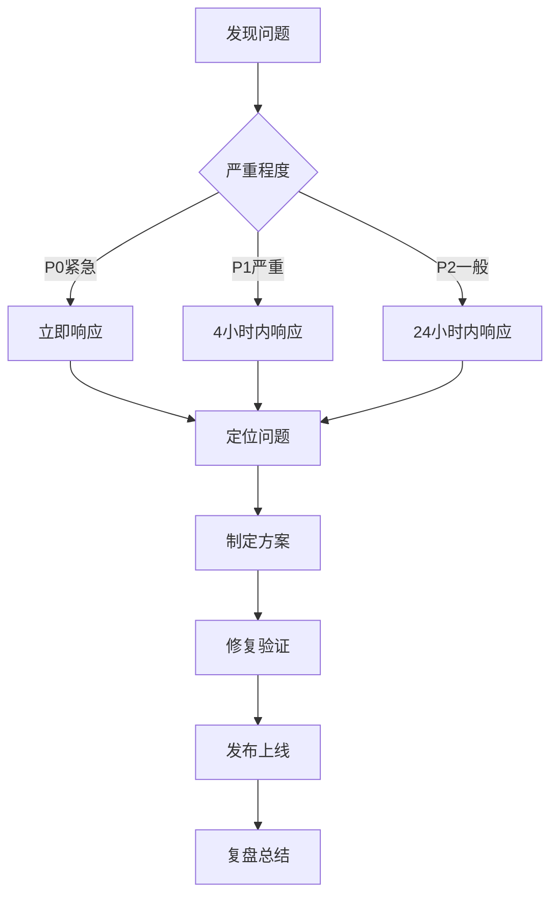

# 开发流程SOP

## 目的
建立标准化的开发流程，确保代码质量、开发效率和团队协作顺畅。

## 开发流程概览


## 1. 开发准备

### 1.1 环境搭建
```bash
# 开发环境要求
- Android Studio: Arctic Fox 2021.3.1+
- JDK: 11 或 17
- Gradle: 8.1.1
- Android SDK: API 24-34

# 项目初始化
git clone https://github.com/company/project.git
cd project
./gradlew build
```

### 1.2 开发规范配置
```kotlin
// 代码格式化配置 (.editorconfig)
[*.{kt,kts}]
indent_size = 4
insert_final_newline = true
max_line_length = 120

// Kotlin代码规范 (detekt.yml)
complexity:
  LongMethod:
    active: true
    threshold: 30
  ComplexMethod:
    active: true
    threshold: 10

style:
  MagicNumber:
    active: true
    excludeEnums: true
    ignoreNumbers: ['-1', '0', '1', '2']
```

### 1.3 分支管理
```bash
# 分支命名规范
main              # 主分支，生产代码
develop           # 开发分支
feature/xxx       # 功能分支
bugfix/xxx        # Bug修复分支
hotfix/xxx        # 紧急修复分支
release/x.x.x     # 发布分支

# 示例
feature/story-generation
bugfix/camera-crash
hotfix/api-timeout
```

## 2. 需求理解

### 2.1 需求确认清单
- [ ] 阅读需求文档和原型
- [ ] 理解验收标准
- [ ] 确认技术可行性
- [ ] 评估工作量
- [ ] 识别依赖关系

### 2.2 技术方案设计
```markdown
# 技术方案模板

## 需求概述
简述需求背景和目标

## 技术方案
### 方案选择
- 方案A：优缺点分析
- 方案B：优缺点分析
- 推荐方案及理由

### 实现细节
- 涉及模块
- 数据流程
- 关键算法
- 第三方依赖

### 工作量评估
- 开发：X人天
- 测试：X人天
- 总计：X人天

### 风险评估
- 技术风险及应对
- 进度风险及应对
```

## 3. 开发实现

### 3.1 任务拆分原则
```markdown
# INVEST原则
- Independent: 任务独立，可并行开发
- Negotiable: 可协商调整
- Valuable: 有业务价值
- Estimable: 可估算工作量
- Small: 足够小（1-3天完成）
- Testable: 可测试验证

# 任务拆分示例
故事生成功能：
├── API接口定义 (0.5天)
├── Repository实现 (1天)
├── UseCase实现 (0.5天)
├── ViewModel逻辑 (1天)
├── UI界面实现 (1天)
├── 单元测试 (1天)
└── 集成测试 (0.5天)
```

### 3.2 编码实践

#### Clean Architecture实现
```kotlin
// Domain层 - 纯Kotlin，无Android依赖
data class Story(
    val id: String,
    val title: String,
    val content: String,
    val questions: List<Question>
)

interface StoryRepository {
    suspend fun generateStory(topic: String): Result<Story>
}

class GenerateStoryUseCase @Inject constructor(
    private val repository: StoryRepository
) {
    suspend operator fun invoke(topic: String): Result<Story> {
        return repository.generateStory(topic)
    }
}

// Data层 - 实现细节
class StoryRepositoryImpl @Inject constructor(
    private val apiService: StoryApiService,
    private val storyDao: StoryDao
) : StoryRepository {
    
    override suspend fun generateStory(topic: String): Result<Story> {
        return try {
            // 1. 调用API
            val response = apiService.generateStory(
                StoryRequest(topic = topic)
            )
            
            // 2. 转换为Domain模型
            val story = response.toDomainModel()
            
            // 3. 缓存到本地
            storyDao.insert(story.toEntity())
            
            Result.success(story)
        } catch (e: Exception) {
            // 4. 失败时尝试返回缓存
            val cachedStory = storyDao.getRandomStory()
            if (cachedStory != null) {
                Result.success(cachedStory.toDomainModel())
            } else {
                Result.failure(e)
            }
        }
    }
}

// Presentation层 - Android相关
@HiltViewModel
class StoryViewModel @Inject constructor(
    private val generateStoryUseCase: GenerateStoryUseCase
) : ViewModel() {
    
    private val _uiState = MutableStateFlow(StoryUiState())
    val uiState: StateFlow<StoryUiState> = _uiState.asStateFlow()
    
    fun generateStory(topic: String) {
        viewModelScope.launch {
            _uiState.update { it.copy(isLoading = true) }
            
            generateStoryUseCase(topic)
                .onSuccess { story ->
                    _uiState.update { 
                        it.copy(
                            isLoading = false,
                            story = story
                        )
                    }
                }
                .onFailure { error ->
                    _uiState.update {
                        it.copy(
                            isLoading = false,
                            error = error.message
                        )
                    }
                }
        }
    }
}
```

#### 错误处理最佳实践
```kotlin
// 统一错误处理
sealed class AppError : Exception() {
    data class Network(override val message: String) : AppError()
    data class Server(val code: Int, override val message: String) : AppError()
    data class Unknown(override val message: String) : AppError()
}

// Repository中的错误处理
suspend fun fetchData(): Result<Data> {
    return try {
        val response = api.getData()
        when {
            response.isSuccessful -> {
                Result.success(response.body()!!)
            }
            response.code() == 401 -> {
                Result.failure(AppError.Server(401, "未授权"))
            }
            else -> {
                Result.failure(AppError.Server(response.code(), "服务器错误"))
            }
        }
    } catch (e: IOException) {
        Result.failure(AppError.Network("网络连接失败"))
    } catch (e: Exception) {
        Result.failure(AppError.Unknown(e.message ?: "未知错误"))
    }
}

// ViewModel中的错误展示
private fun handleError(error: AppError) {
    val message = when (error) {
        is AppError.Network -> "请检查网络连接"
        is AppError.Server -> when (error.code) {
            401 -> "请重新登录"
            404 -> "内容不存在"
            else -> "服务器错误(${error.code})"
        }
        is AppError.Unknown -> "出错了，请稍后重试"
    }
    _uiState.update { it.copy(errorMessage = message) }
}
```

### 3.3 测试驱动开发（TDD）

#### 单元测试示例
```kotlin
class StoryViewModelTest {
    
    @get:Rule
    val instantExecutorRule = InstantTaskExecutorRule()
    
    @get:Rule
    val mainDispatcherRule = MainDispatcherRule()
    
    private lateinit var generateStoryUseCase: GenerateStoryUseCase
    private lateinit var viewModel: StoryViewModel
    
    @Before
    fun setup() {
        generateStoryUseCase = mockk()
        viewModel = StoryViewModel(generateStoryUseCase)
    }
    
    @Test
    fun `generateStory success should update ui state with story`() = runTest {
        // Given
        val topic = "恐龙"
        val expectedStory = Story(
            id = "1",
            title = "小恐龙的冒险",
            content = "从前有一只小恐龙...",
            questions = emptyList()
        )
        coEvery { generateStoryUseCase(topic) } returns Result.success(expectedStory)
        
        // When
        viewModel.generateStory(topic)
        advanceUntilIdle()
        
        // Then
        val state = viewModel.uiState.value
        assertFalse(state.isLoading)
        assertEquals(expectedStory, state.story)
        assertNull(state.error)
    }
    
    @Test
    fun `generateStory failure should update ui state with error`() = runTest {
        // Given
        val topic = "恐龙"
        val error = AppError.Network("网络错误")
        coEvery { generateStoryUseCase(topic) } returns Result.failure(error)
        
        // When
        viewModel.generateStory(topic)
        advanceUntilIdle()
        
        // Then
        val state = viewModel.uiState.value
        assertFalse(state.isLoading)
        assertNull(state.story)
        assertEquals("请检查网络连接", state.error)
    }
}
```

### 3.4 调试技巧

#### 日志规范
```kotlin
// 使用Timber进行日志管理
class MyApp : Application() {
    override fun onCreate() {
        super.onCreate()
        if (BuildConfig.DEBUG) {
            Timber.plant(Timber.DebugTree())
        } else {
            Timber.plant(CrashReportingTree())
        }
    }
}

// 日志使用
Timber.d("generateStory called with topic: $topic")
Timber.e(exception, "Failed to generate story")

// 网络请求日志
val loggingInterceptor = HttpLoggingInterceptor { message ->
    Timber.tag("OkHttp").d(message)
}.apply {
    level = if (BuildConfig.DEBUG) {
        HttpLoggingInterceptor.Level.BODY
    } else {
        HttpLoggingInterceptor.Level.NONE
    }
}
```

#### 调试工具
```kotlin
// Layout Inspector - 查看UI层级
// View > Tool Windows > Layout Inspector

// Database Inspector - 查看数据库
// View > Tool Windows > App Inspection > Database Inspector

// Network Profiler - 监控网络请求
// View > Tool Windows > Profiler > Network

// Memory Profiler - 检测内存泄漏
// View > Tool Windows > Profiler > Memory
```

## 4. 代码提交

### 4.1 提交前检查
```bash
# 运行本地测试
./gradlew test

# 代码格式化
./gradlew ktlintFormat

# 静态代码检查
./gradlew detekt

# 构建检查
./gradlew assembleDebug
```

### 4.2 提交规范
```bash
# Commit Message格式
<type>(<scope>): <subject>

<body>

<footer>

# type类型
feat: 新功能
fix: 修复bug
docs: 文档更新
style: 代码格式调整
refactor: 重构
test: 测试相关
chore: 构建或辅助工具变动

# 示例
feat(story): 添加故事生成功能

- 实现故事生成API调用
- 添加本地缓存机制
- 支持离线故事展示

Closes #123
```

### 4.3 Pull Request规范
```markdown
## 描述
简要说明这个PR的目的和改动内容

## 改动类型
- [ ] Bug修复
- [x] 新功能
- [ ] 代码重构
- [ ] 文档更新

## 改动内容
- 添加了故事生成功能
- 实现了错误处理和重试机制
- 添加了相关单元测试

## 测试
- [x] 本地测试通过
- [x] 添加了新的测试用例
- [x] 现有测试未受影响

## 截图（如果涉及UI改动）
[添加截图]

## 相关Issue
Closes #123
```

## 5. 持续集成

### 5.1 CI配置
```yaml
# .github/workflows/android.yml
name: Android CI

on:
  push:
    branches: [ main, develop ]
  pull_request:
    branches: [ main, develop ]

jobs:
  test:
    runs-on: ubuntu-latest
    steps:
    - uses: actions/checkout@v3
    
    - name: Set up JDK 11
      uses: actions/setup-java@v3
      with:
        java-version: '11'
        distribution: 'adopt'
    
    - name: Grant execute permission for gradlew
      run: chmod +x gradlew
    
    - name: Run tests
      run: ./gradlew test
    
    - name: Run lint
      run: ./gradlew lint
    
    - name: Run detekt
      run: ./gradlew detekt
    
    - name: Build debug APK
      run: ./gradlew assembleDebug
    
    - name: Upload test results
      uses: actions/upload-artifact@v3
      if: failure()
      with:
        name: test-results
        path: app/build/reports/tests
```

### 5.2 代码质量门禁
```kotlin
// 质量检查标准
- 代码覆盖率 > 80%
- 技术债务比例 < 5%
- 重复代码率 < 3%
- 圈复杂度 < 10
```

## 6. 最佳实践

### DO ✅
1. **小步提交**: 频繁提交，每次改动不要太大
2. **写好测试**: TDD开发，先写测试再写代码
3. **及时重构**: 发现问题立即重构
4. **代码审查**: 认真review他人代码
5. **持续学习**: 学习新技术和最佳实践

### DON'T ❌
1. **大量改动**: 避免一次提交几千行
2. **忽视警告**: 不要忽视编译器警告
3. **复制粘贴**: 避免重复代码
4. **过早优化**: 先实现功能再优化
5. **单打独斗**: 遇到问题及时沟通

## 7. 故障处理

### 7.1 线上问题处理流程


### 7.2 问题定位技巧
1. **查看日志**: Crashlytics、服务器日志
2. **复现问题**: 相同环境和步骤
3. **二分法**: 缩小问题范围
4. **对比分析**: 与正常情况对比
5. **工具辅助**: 使用调试工具

---

*基于AI启蒙时光项目开发实践*  
*强调代码质量和开发效率*