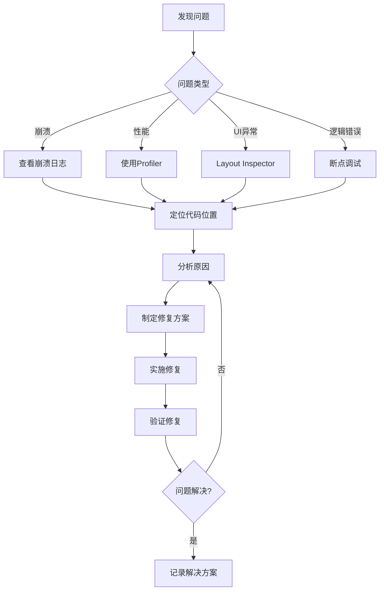

# 调试与问题修复SOP

## 目的
提供系统化的调试方法和常见问题的修复方案，帮助开发者快速定位和解决问题。

## 1. 调试工具箱

### 1.1 基础调试工具配置
```kotlin
/**
 * 调试工具初始化
 * 位置：Application类
 */
class EnlightenmentApp : Application() {
    override fun onCreate() {
        super.onCreate()
        
        // 1. Timber日志配置
        if (BuildConfig.DEBUG) {
            Timber.plant(object : Timber.DebugTree() {
                override fun createStackElementTag(element: StackTraceElement): String {
                    // 自定义日志标签，包含类名和行号
                    return "${super.createStackElementTag(element)}:${element.lineNumber}"
                }
            })
        }
        
        // 2. StrictMode配置（仅调试版本）
        if (BuildConfig.DEBUG) {
            StrictMode.setThreadPolicy(
                StrictMode.ThreadPolicy.Builder()
                    .detectDiskReads()
                    .detectDiskWrites()
                    .detectNetwork()
                    .penaltyLog()
                    .build()
            )
            StrictMode.setVmPolicy(
                StrictMode.VmPolicy.Builder()
                    .detectActivityLeaks()
                    .detectLeakedClosableObjects()
                    .penaltyLog()
                    .build()
            )
        }
        
        // 3. LeakCanary自动初始化（添加依赖后自动工作）
    }
}
```

### 1.2 网络调试配置
```kotlin
/**
 * OkHttp调试拦截器
 * 位置：NetworkModule
 */
@Module
@InstallIn(SingletonComponent::class)
object NetworkModule {
    
    @Provides
    @Singleton
    fun provideOkHttpClient(): OkHttpClient {
        return OkHttpClient.Builder().apply {
            // 1. 日志拦截器
            if (BuildConfig.DEBUG) {
                val loggingInterceptor = HttpLoggingInterceptor { message ->
                    // 使用Timber输出网络日志
                    Timber.tag("OkHttp").d(message)
                }.apply {
                    level = HttpLoggingInterceptor.Level.BODY
                }
                addInterceptor(loggingInterceptor)
            }
            
            // 2. Chuck/Chucker网络监控（可选）
            if (BuildConfig.DEBUG) {
                // addInterceptor(ChuckerInterceptor(context))
            }
            
            // 3. 自定义调试拦截器
            addInterceptor(DebugInterceptor())
            
            // 4. 超时设置
            connectTimeout(30, TimeUnit.SECONDS)
            readTimeout(30, TimeUnit.SECONDS)
        }.build()
    }
}

/**
 * 自定义调试拦截器
 * 记录请求耗时和错误信息
 */
class DebugInterceptor : Interceptor {
    override fun intercept(chain: Interceptor.Chain): Response {
        val request = chain.request()
        val startTime = System.currentTimeMillis()
        
        Timber.d("🌐 API请求: ${request.method} ${request.url}")
        Timber.d("📤 请求头: ${request.headers}")
        
        return try {
            val response = chain.proceed(request)
            val duration = System.currentTimeMillis() - startTime
            
            Timber.d("✅ API响应: ${response.code} (${duration}ms)")
            
            // 记录慢请求
            if (duration > 3000) {
                Timber.w("⚠️ 慢请求警告: ${request.url} 耗时 ${duration}ms")
            }
            
            response
        } catch (e: Exception) {
            val duration = System.currentTimeMillis() - startTime
            Timber.e(e, "❌ API请求失败: ${request.url} (${duration}ms)")
            throw e
        }
    }
}
```

## 2. 常见问题诊断与修复

### 2.1 崩溃问题排查
```kotlin
/**
 * 崩溃日志收集与分析
 */

// 1. 全局异常处理器
class CrashHandler : Thread.UncaughtExceptionHandler {
    
    private val defaultHandler = Thread.getDefaultUncaughtExceptionHandler()
    
    override fun uncaughtException(thread: Thread, throwable: Throwable) {
        // 记录崩溃信息
        Timber.e(throwable, "💥 应用崩溃")
        
        // 保存崩溃日志到文件
        saveCrashLog(throwable)
        
        // 上报到Crashlytics（如果集成）
        // FirebaseCrashlytics.getInstance().recordException(throwable)
        
        // 调用默认处理器
        defaultHandler?.uncaughtException(thread, throwable)
    }
    
    private fun saveCrashLog(throwable: Throwable) {
        val crashInfo = buildString {
            appendLine("=== 崩溃信息 ===")
            appendLine("时间: ${Date()}")
            appendLine("设备: ${Build.MODEL} (${Build.VERSION.SDK_INT})")
            appendLine("版本: ${BuildConfig.VERSION_NAME}")
            appendLine()
            appendLine("=== 异常堆栈 ===")
            appendLine(throwable.stackTraceToString())
        }
        
        // 保存到文件或上传服务器
        Timber.d("崩溃日志:\n$crashInfo")
    }
}

// 2. 在Application中注册
class EnlightenmentApp : Application() {
    override fun onCreate() {
        super.onCreate()
        
        // 设置崩溃处理器
        Thread.setDefaultUncaughtExceptionHandler(CrashHandler())
    }
}
```

### 2.2 内存泄漏排查
```kotlin
/**
 * 内存泄漏检测与修复
 */

// 1. 常见内存泄漏场景及修复

// ❌ 错误：Activity泄漏
class LeakyActivity : AppCompatActivity() {
    companion object {
        var instance: LeakyActivity? = null  // 静态引用导致泄漏
    }
    
    override fun onCreate(savedInstanceState: Bundle?) {
        super.onCreate(savedInstanceState)
        instance = this  // 内存泄漏！
    }
}

// ✅ 正确：使用WeakReference
class SafeActivity : AppCompatActivity() {
    companion object {
        var instance: WeakReference<SafeActivity>? = null
    }
    
    override fun onCreate(savedInstanceState: Bundle?) {
        super.onCreate(savedInstanceState)
        instance = WeakReference(this)
    }
    
    override fun onDestroy() {
        super.onDestroy()
        instance?.clear()
    }
}

// 2. ViewModel中的内存泄漏

// ❌ 错误：持有Context引用
class LeakyViewModel(
    private val context: Context  // 可能泄漏Activity
) : ViewModel()

// ✅ 正确：使用Application Context
class SafeViewModel(
    private val application: Application  // 使用Application Context
) : AndroidViewModel(application)

// 3. 协程作用域管理

// ❌ 错误：使用GlobalScope
class LeakyRepository {
    fun fetchData() {
        GlobalScope.launch {  // 生命周期不受控制
            // 长时间运行的任务
        }
    }
}

// ✅ 正确：使用合适的作用域
class SafeRepository {
    private val scope = CoroutineScope(Dispatchers.IO + SupervisorJob())
    
    fun fetchData() {
        scope.launch {
            // 任务会在scope取消时自动取消
        }
    }
    
    fun cleanup() {
        scope.cancel()  // 清理时取消所有任务
    }
}
```

### 2.3 ANR（应用无响应）问题
```kotlin
/**
 * ANR问题诊断与解决
 */

// 1. 检测主线程阻塞
class ANRWatchdog : Thread() {
    
    @Volatile
    private var tick = 0
    private val threshold = 5000  // 5秒阈值
    
    private val ticker = Runnable {
        tick = (tick + 1) % Int.MAX_VALUE
    }
    
    override fun run() {
        while (!isInterrupted) {
            val lastTick = tick
            Handler(Looper.getMainLooper()).post(ticker)
            
            Thread.sleep(threshold)
            
            if (tick == lastTick) {
                // 主线程被阻塞
                Timber.e("⚠️ 检测到ANR！主线程被阻塞超过${threshold}ms")
                // 获取主线程堆栈
                val stackTrace = Looper.getMainLooper().thread.stackTrace
                stackTrace.forEach { element ->
                    Timber.e("  at $element")
                }
            }
        }
    }
}

// 2. 避免ANR的最佳实践

// ❌ 错误：主线程执行耗时操作
class BadActivity : AppCompatActivity() {
    override fun onCreate(savedInstanceState: Bundle?) {
        super.onCreate(savedInstanceState)
        
        // 主线程读取大文件 - 导致ANR！
        val data = File("/sdcard/large_file.txt").readText()
    }
}

// ✅ 正确：使用协程处理耗时操作
class GoodActivity : AppCompatActivity() {
    override fun onCreate(savedInstanceState: Bundle?) {
        super.onCreate(savedInstanceState)
        
        lifecycleScope.launch {
            // IO线程读取文件
            val data = withContext(Dispatchers.IO) {
                File("/sdcard/large_file.txt").readText()
            }
            // 回到主线程更新UI
            updateUI(data)
        }
    }
}
```

### 2.4 Compose UI问题调试
```kotlin
/**
 * Compose特有的调试技巧
 */

// 1. 重组次数追踪
class RecompositionCounter {
    var count by mutableStateOf(0)
        private set
    
    fun track(tag: String) {
        count++
        Timber.d("🔄 [$tag] 重组次数: $count")
    }
}

@Composable
fun TrackedComposable() {
    val counter = remember { RecompositionCounter() }
    
    // 追踪重组
    SideEffect {
        counter.track("TrackedComposable")
    }
    
    Column {
        Text("重组次数: ${counter.count}")
        // UI内容
    }
}

// 2. 性能问题定位
@Composable
fun PerformanceIssueExample() {
    // ❌ 错误：每次重组都创建新对象
    Column {
        val heavyObject = createHeavyObject()  // 性能问题！
    }
    
    // ✅ 正确：使用remember缓存
    Column {
        val heavyObject = remember { createHeavyObject() }
    }
    
    // ✅ 使用derivedStateOf优化计算
    val items = remember { mutableStateListOf<Item>() }
    val filteredItems = remember {
        derivedStateOf {
            items.filter { it.isVisible }
        }
    }
}

// 3. 布局边界可视化
@Composable
fun DebugLayout(
    content: @Composable () -> Unit
) {
    if (BuildConfig.DEBUG) {
        Box(
            modifier = Modifier
                .border(1.dp, Color.Red)  // 显示边界
                .padding(1.dp)
        ) {
            content()
        }
    } else {
        content()
    }
}
```

## 3. 性能问题诊断

### 3.1 启动性能优化
```kotlin
/**
 * 应用启动时间分析与优化
 */

// 1. 启动时间测量
class StartupTimer {
    companion object {
        private var startTime = 0L
        private val measurements = mutableMapOf<String, Long>()
        
        fun start() {
            startTime = System.currentTimeMillis()
        }
        
        fun measure(phase: String) {
            val duration = System.currentTimeMillis() - startTime
            measurements[phase] = duration
            Timber.d("⏱️ 启动耗时 - $phase: ${duration}ms")
        }
        
        fun report() {
            Timber.d("=== 启动性能报告 ===")
            measurements.forEach { (phase, duration) ->
                Timber.d("$phase: ${duration}ms")
            }
            val total = System.currentTimeMillis() - startTime
            Timber.d("总耗时: ${total}ms")
        }
    }
}

// 2. Application优化
class EnlightenmentApp : Application() {
    override fun attachBaseContext(base: Context) {
        super.attachBaseContext(base)
        StartupTimer.start()
    }
    
    override fun onCreate() {
        super.onCreate()
        
        // 必要的初始化
        initCriticalComponents()
        StartupTimer.measure("关键组件初始化")
        
        // 延迟初始化非关键组件
        Handler(Looper.getMainLooper()).post {
            initNonCriticalComponents()
            StartupTimer.measure("非关键组件初始化")
        }
    }
    
    private fun initCriticalComponents() {
        // 只初始化启动必需的组件
        Timber.plant(Timber.DebugTree())
    }
    
    private fun initNonCriticalComponents() {
        // 延迟初始化
        // - 分析工具
        // - 广告SDK
        // - 其他第三方库
    }
}
```

### 3.2 列表性能优化
```kotlin
/**
 * RecyclerView/LazyColumn性能问题诊断
 */

// 1. Compose LazyColumn优化
@Composable
fun OptimizedList(items: List<Item>) {
    LazyColumn {
        items(
            items = items,
            key = { it.id },  // 使用稳定的key
            contentType = { it.type }  // 指定内容类型
        ) { item ->
            // 使用remember避免重复创建
            val processedData = remember(item.id) {
                processItemData(item)
            }
            
            ItemCard(processedData)
        }
    }
}

// 2. 图片加载优化
@Composable
fun OptimizedImage(url: String) {
    AsyncImage(
        model = ImageRequest.Builder(LocalContext.current)
            .data(url)
            .crossfade(true)
            .memoryCachePolicy(CachePolicy.ENABLED)
            .diskCachePolicy(CachePolicy.ENABLED)
            .size(Size.ORIGINAL)  // 指定大小避免过度解码
            .build(),
        contentDescription = null,
        modifier = Modifier.fillMaxWidth()
    )
}
```

## 4. 调试工作流程

### 4.1 问题定位流程


### 4.2 调试检查清单
```kotlin
/**
 * 系统化的调试步骤
 * 
 * 1. 复现问题
 *    □ 记录复现步骤
 *    □ 确定问题发生条件
 *    □ 收集设备信息
 * 
 * 2. 收集信息
 *    □ 查看Logcat日志
 *    □ 获取崩溃堆栈
 *    □ 检查网络请求
 *    □ 分析内存使用
 * 
 * 3. 定位原因
 *    □ 使用断点调试
 *    □ 添加日志输出
 *    □ 二分法缩小范围
 *    □ 对比正常情况
 * 
 * 4. 验证修复
 *    □ 问题不再复现
 *    □ 没有引入新问题
 *    □ 性能没有退化
 *    □ 添加防护测试
 */
```

### 4.3 调试日志最佳实践
```kotlin
/**
 * 结构化的调试日志
 */
object DebugLogger {
    
    // 使用emoji让日志更清晰
    fun logApiCall(method: String, url: String) {
        Timber.d("🌐 API调用: $method $url")
    }
    
    fun logUserAction(action: String, details: Map<String, Any>? = null) {
        Timber.d("👆 用户操作: $action ${details?.let { "- $it" } ?: ""}")
    }
    
    fun logStateChange(component: String, oldState: Any?, newState: Any?) {
        Timber.d("🔄 状态变更 [$component]: $oldState → $newState")
    }
    
    fun logPerformance(operation: String, duration: Long) {
        val emoji = when {
            duration < 100 -> "🚀"
            duration < 500 -> "✅"
            duration < 1000 -> "⚠️"
            else -> "🐌"
        }
        Timber.d("$emoji 性能 [$operation]: ${duration}ms")
    }
    
    fun logError(error: Throwable, context: String) {
        Timber.e(error, "❌ 错误 [$context]")
    }
}

// 使用示例
class StoryViewModel : ViewModel() {
    fun loadStory(id: String) {
        DebugLogger.logUserAction("加载故事", mapOf("id" to id))
        
        viewModelScope.launch {
            try {
                val startTime = System.currentTimeMillis()
                val story = repository.getStory(id)
                val duration = System.currentTimeMillis() - startTime
                
                DebugLogger.logPerformance("加载故事", duration)
                DebugLogger.logStateChange("StoryScreen", "Loading", "Success")
                
            } catch (e: Exception) {
                DebugLogger.logError(e, "加载故事失败")
            }
        }
    }
}
```

## 5. 生产环境问题排查

### 5.1 远程日志收集
```kotlin
/**
 * 生产环境日志收集方案
 */
class RemoteLogger {
    
    private val logBuffer = mutableListOf<LogEntry>()
    private val maxBufferSize = 100
    
    data class LogEntry(
        val timestamp: Long,
        val level: String,
        val tag: String,
        val message: String,
        val extra: Map<String, Any>? = null
    )
    
    fun log(level: String, tag: String, message: String, extra: Map<String, Any>? = null) {
        val entry = LogEntry(
            timestamp = System.currentTimeMillis(),
            level = level,
            tag = tag,
            message = message,
            extra = extra
        )
        
        synchronized(logBuffer) {
            logBuffer.add(entry)
            if (logBuffer.size > maxBufferSize) {
                logBuffer.removeAt(0)
            }
        }
        
        // 严重错误立即上报
        if (level == "ERROR" || level == "FATAL") {
            uploadLogs()
        }
    }
    
    fun uploadLogs() {
        val logsToUpload = synchronized(logBuffer) {
            logBuffer.toList().also { logBuffer.clear() }
        }
        
        // 上传到服务器
        // api.uploadLogs(logsToUpload)
    }
}
```

### 5.2 用户反馈系统
```kotlin
/**
 * 应用内反馈收集
 */
@Composable
fun FeedbackDialog(
    onDismiss: () -> Unit,
    onSubmit: (String, List<Uri>) -> Unit
) {
    var feedback by remember { mutableStateOf("") }
    var screenshots by remember { mutableStateOf<List<Uri>>(emptyList()) }
    
    AlertDialog(
        onDismissRequest = onDismiss,
        title = { Text("遇到问题了吗？") },
        text = {
            Column {
                OutlinedTextField(
                    value = feedback,
                    onValueChange = { feedback = it },
                    label = { Text("请描述您遇到的问题") },
                    modifier = Modifier.fillMaxWidth()
                )
                
                // 截图附件
                Row {
                    TextButton(onClick = { /* 添加截图 */ }) {
                        Icon(Icons.Default.Image, null)
                        Text("添加截图")
                    }
                }
            }
        },
        confirmButton = {
            TextButton(
                onClick = {
                    // 收集设备信息
                    val deviceInfo = buildString {
                        appendLine("设备: ${Build.MODEL}")
                        appendLine("系统: Android ${Build.VERSION.RELEASE}")
                        appendLine("应用版本: ${BuildConfig.VERSION_NAME}")
                    }
                    
                    // 提交反馈
                    onSubmit(
                        "$feedback\n\n--- 设备信息 ---\n$deviceInfo",
                        screenshots
                    )
                }
            ) {
                Text("提交")
            }
        },
        dismissButton = {
            TextButton(onClick = onDismiss) {
                Text("取消")
            }
        }
    )
}
```

## 最佳实践总结

### DO ✅
1. **预防胜于治疗**：编写防御性代码
2. **日志要有结构**：使用统一的日志格式
3. **保留现场**：崩溃时收集完整信息
4. **逐步缩小范围**：使用二分法定位问题
5. **记录解决方案**：相同问题不要重复踩坑

### DON'T ❌
1. **忽视警告**：编译警告往往是问题前兆
2. **过度日志**：生产环境避免敏感信息
3. **修改不测试**：每次修复都要验证
4. **依赖猜测**：用数据和日志说话
5. **独自奋战**：复杂问题要团队协作

---

*调试与问题修复SOP v1.0*  
*让调试成为一种享受而非折磨*