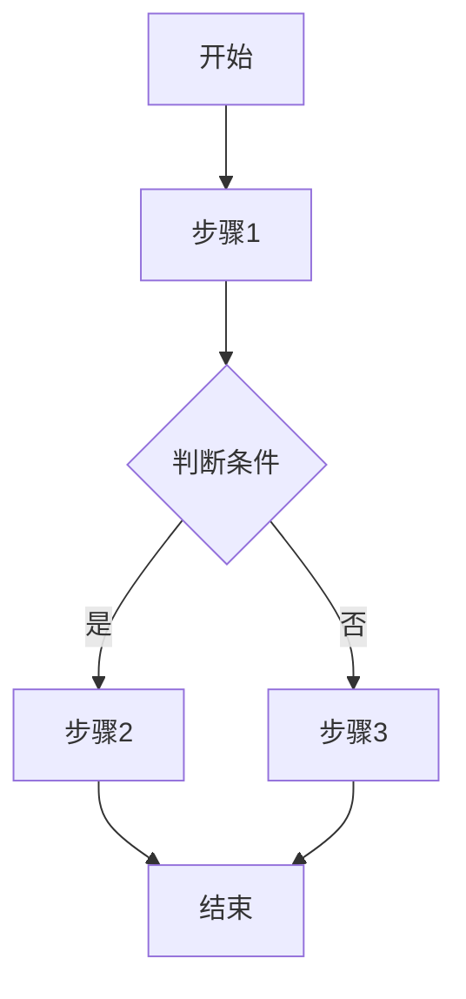

# [功能名称]需求文档

**文档版本**: v1.0  
**创建日期**: YYYY-MM-DD  
**作者**: [姓名]  
**审核人**: [姓名]  

## 1. 需求概述

### 1.1 需求背景
[描述为什么需要这个功能，解决什么问题]

### 1.2 目标用户
- 主要用户：[用户群体描述]
- 使用场景：[典型使用场景]
- 用户价值：[给用户带来什么价值]

### 1.3 业务目标
- [ ] 目标1：[具体可衡量的目标]
- [ ] 目标2：[具体可衡量的目标]
- [ ] 目标3：[具体可衡量的目标]

## 2. 功能详述

### 2.1 功能范围
**包含**：
- [功能点1]
- [功能点2]
- [功能点3]

**不包含**：
- [明确不做的功能1]
- [明确不做的功能2]

### 2.2 用户故事
```
作为 [用户角色]
我想要 [功能/目标]
以便 [价值/原因]

验收标准：
1. [具体可验证的条件]
2. [具体可验证的条件]
3. [具体可验证的条件]
```

### 2.3 功能流程


### 2.4 交互设计
[插入原型图或线框图]

**交互说明**：
1. [交互点1的说明]
2. [交互点2的说明]
3. [交互点3的说明]

## 3. 业务规则

### 3.1 数据规则
| 字段名 | 类型 | 必填 | 规则说明 |
|-------|------|------|---------|
| [字段1] | String | 是 | 长度2-20字符 |
| [字段2] | Int | 否 | 范围0-100 |
| [字段3] | Boolean | 是 | 默认false |

### 3.2 业务逻辑
1. **规则1**：[具体规则描述]
2. **规则2**：[具体规则描述]
3. **规则3**：[具体规则描述]

### 3.3 异常处理
| 异常场景 | 处理方式 | 提示文案 |
|---------|---------|---------|
| 网络异常 | 显示缓存数据 | "网络不给力，请稍后重试" |
| 数据为空 | 显示空状态页 | "暂无内容" |
| 权限不足 | 跳转登录页 | "请先登录" |

## 4. 非功能需求

### 4.1 性能要求
- 页面加载时间：< 2秒
- 响应时间：< 500ms
- 并发用户数：支持1000+

### 4.2 安全要求
- [ ] 数据传输加密
- [ ] 敏感信息脱敏
- [ ] 权限校验

### 4.3 兼容性要求
- Android版本：7.0+（API 24+）
- 屏幕适配：手机、平板
- 横竖屏：支持/仅竖屏

## 5. 验收标准

### 5.1 功能验收
- [ ] 所有用户故事完成
- [ ] 所有业务规则实现
- [ ] 异常场景处理正常

### 5.2 性能验收
- [ ] 满足性能指标要求
- [ ] 无内存泄漏
- [ ] 无ANR问题

### 5.3 质量验收
- [ ] 通过所有测试用例
- [ ] 代码审查通过
- [ ] 无P0/P1级别bug

## 6. 依赖说明

### 6.1 前置依赖
- [依赖功能1]：需要先完成
- [依赖功能2]：需要同步开发

### 6.2 外部依赖
- [第三方服务1]：用于XXX
- [第三方SDK]：版本要求

### 6.3 数据依赖
- [数据源1]：提供XXX数据
- [API接口]：需要后端支持

## 7. 工作量评估

| 任务项 | 负责人 | 预估工时 | 备注 |
|-------|--------|---------|------|
| UI开发 | [姓名] | 3人天 | 包含适配 |
| 业务逻辑 | [姓名] | 2人天 | 核心功能 |
| 接口对接 | [姓名] | 1人天 | 依赖后端 |
| 测试 | [姓名] | 2人天 | 含自动化 |
| **总计** | - | **8人天** | - |

## 8. 风险评估

| 风险项 | 可能性 | 影响 | 应对措施 |
|-------|--------|------|---------|
| 接口延期 | 中 | 高 | 先用Mock数据开发 |
| 性能问题 | 低 | 中 | 提前性能测试 |
| 需求变更 | 中 | 中 | 保持沟通，敏捷应对 |

## 9. 发布计划

### 9.1 里程碑
- **M1**（第一周）：完成UI开发
- **M2**（第二周）：完成功能开发
- **M3**（第三周）：完成测试修复

### 9.2 发布策略
- [ ] 灰度发布：5% → 20% → 50% → 100%
- [ ] A/B测试：新老版本对比
- [ ] 全量发布：一次性发布

## 10. 附录

### 10.1 参考资料
- [竞品分析文档]
- [用户调研报告]
- [技术预研文档]

### 10.2 名词解释
- **术语1**：解释说明
- **术语2**：解释说明

### 10.3 修订记录
| 版本 | 日期 | 修改人 | 修改内容 |
|------|------|--------|---------|
| v1.0 | YYYY-MM-DD | [姓名] | 初始版本 |

---

*需求文档模板 v1.0*