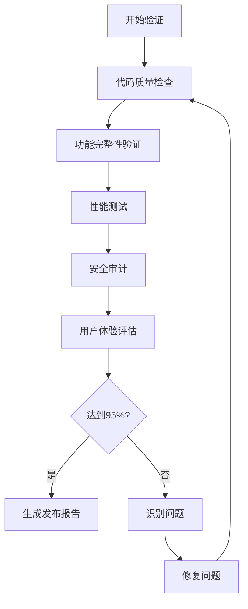

# 项目验证标准操作程序（SOP）

## 概述

本目录包含AI启蒙时光项目的完整验证SOP方案，确保项目达到95%以上的生产就绪标准。

## 目录结构

```
docs/sop/validate/
├── README.md                     # 本文档
├── 01-validation-framework.md    # 验证框架总览
├── 02-code-quality-sop.md       # 代码质量验证SOP
├── 03-functionality-sop.md      # 功能完整性验证SOP
├── 04-performance-sop.md        # 性能验证SOP
├── 05-security-sop.md           # 安全验证SOP
├── 06-ux-validation-sop.md      # 用户体验验证SOP
├── scripts/                      # 验证脚本
│   ├── quality-check.sh         # 代码质量检查脚本
│   ├── validator-v5-fixed.py    # 智能验证器
│   └── deep-validator.sh        # 深度验证脚本
└── reports/                      # 验证报告模板
    ├── validation-report-template.md
    └── checklist-template.md
```

## 快速开始

1. **基础验证**：运行 `scripts/quality-check.sh`
2. **智能验证**：运行 `scripts/validator-v5-fixed.py`
3. **深度验证**：运行 `scripts/deep-validator.sh`
4. **生成报告**：使用 `reports/` 中的模板

## 验证标准

- **目标完成度**：95%以上
- **代码质量**：无TODO、无空实现、完整错误处理
- **测试覆盖**：85%以上
- **性能指标**：启动<3秒、内存<150MB、无ANR
- **安全要求**：数据加密、API密钥保护、内容过滤

## 验证流程



## 关键经验教训

1. **避免过度验证**：V6.0的38个问题中37个是误报
2. **理解代码语义**：接口不需要错误处理实现
3. **关注真实问题**：专注于影响用户的实际问题
4. **持续改进**：验证是迭代过程，不是一次性任务

---

*SOP版本：1.0*  
*最后更新：2024年12月30日*